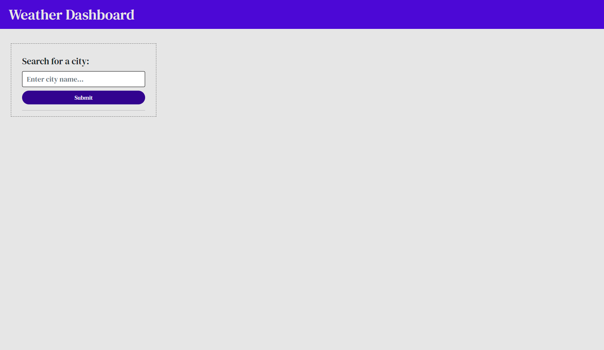

# Weather Dashboard Application

## Description

This is a basic weather dashboard application that utilizes the OpenWeatherMap API. You can search for any city (also works for countries) around the globe and you will be presented with a daily forecast, as well as a five day forecast for that place. It also saves your search history, and displays your 10 most recent entries, which updates dynamically.

## Visuals

## Usage

Enter any city you want to see the data fr in the search bar to the left. Keep in mind, you must enter a valid city or an error message will appear. Once you do this, a current forecast showing the date, an icon depicting the current weather condition, the temperature, the wind speed, and the humidity will appear at the top; and just below you will see a 5 day forecast with the same information. On the left side of the page, your 10 most-recent searches will appear in chronological order, starting from newest to oldest.

[https://zaingova.github.io/zaingova-weather-dashboard/](https://zaingova.github.io/zaingova-weather-dashboard/)

## Licence

Standard MIT Licence