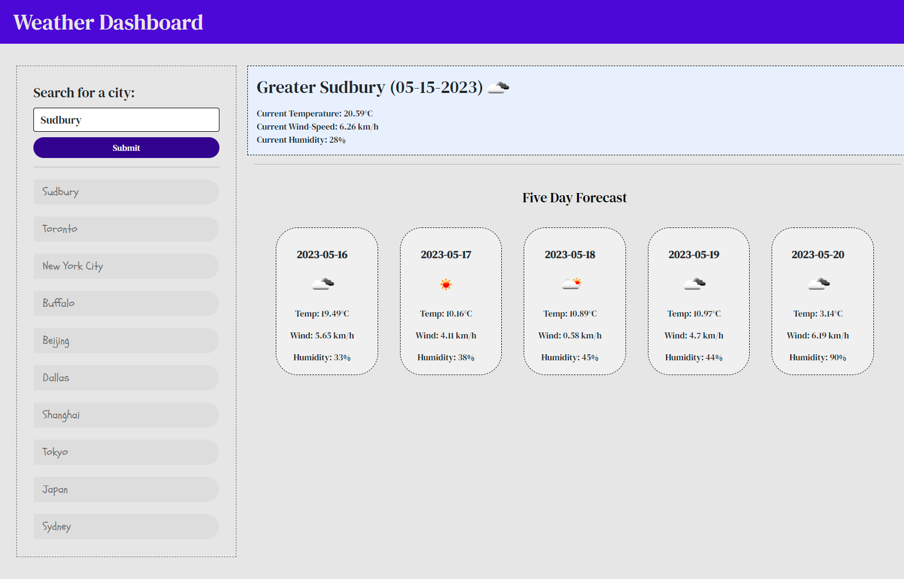

# Weather Dashboard Application

## Description

This is a basic weather dashboard application that utilizes the OpenWeatherMap API. You can search for any city (also works for countries) around the globe and you will be presented with a daily forecast, as well as a five day forecast for that place. It also saves your search history, and displays your 10 most recent entries, which updates dynamically.

# Visuals

